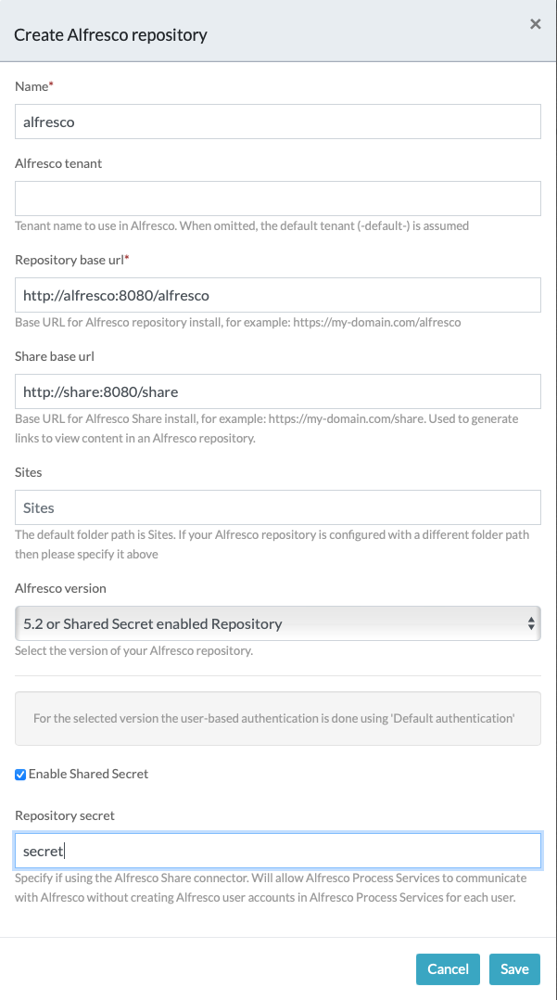
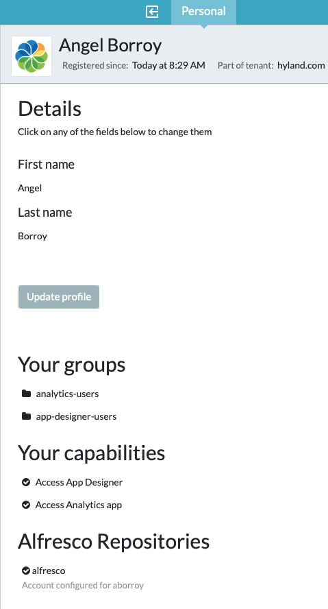
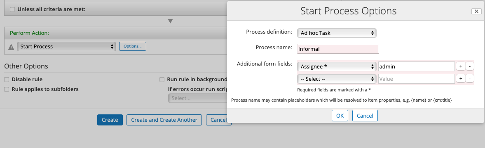

# Sample Deployment for Alfresco Share using APS Action

When using [Alfresco Share](https://docs.alfresco.com/content-services/latest/using/share/) together with [APS](https://docs.alfresco.com/process-services/latest/), APS Action Share addon can be used to create an instance of a process in APS from a folder rule in ACS.

To configure an APS action there are several prerequisites that must be met:

* Alfresco Content Services
  * JAR file for `activiti-repo-connector` addon applied to Repository
  * AMP file for `aps-action-share` addon applied to Share
* Alfresco Process Services
* Content Services and Process Services using a common LDAP database to sync users from

Docker Images from [quay.io](https://quay.io/organization/alfresco) are used, since this product is only available for Alfresco Enterprise customers. If you are Enterprise Customer or Partner but you are still experimenting problems to download Docker Images, contact [Alfresco Hyland Support](https://community.hyland.com) in order to get required credentials and permissions.

This project provides a *sample* Docker Compose template for Alfresco Community 7.4 with Alfresco Process Services 2.4. Note that deploying in *production* environments would require additional configuration.

## Docker Compose

Docker Compose template `compose.yaml` includes following files:

```
.
├── .env
├── compose.yaml
├── activiti
│   ├── db
│   │   └── init.sql
│   ├── ldap
│   │   └── activiti-ldap.properties
│   └── license
│       └── activiti.lic  << This file is not included in this project, copy your owned activiti.lic file to this location (!)
├── alfresco
│   ├── Dockerfile
│   └── jars
│       └── activiti-repo-connector-1.14.jar
├── ldap
│   └── bootstrap.ldif
└── share
    ├── Dockerfile
    └── amps
        └── aps-action-share-7.0.0.1.amp
```

* `.env` includes Docker Image tag names and versions
* `compose.yml` is a regular ACS Docker Compose, including APS and LDAP services
* `activiti` folder includes configuration resources for APS
  * `db` is used for Activiti DB initialization
  * `ldap` includes LDAP configuration for Activiti
  * `license` is an empty folder. Place your `activiti.lic` file in this location
* `alfresco` extends default Alfresco Repository Docker Image to apply the `activiti-repo-connector` addon
* `share` extends default Alfresco Share Docker Image to apply the `aps-action-share` addon
* `ldap` includes initialization data for LDAP service

## Using

>> Remember to copy your `activiti.lic` file to `activiti/license` folder before running the project

```
$ docker-compose up --build --force-recreate
```

## Service URLs

http://localhost:9091/activiti-admin/

APS Activiti Admin

* user: admin
* password: admin

http://localhost:9090/activiti-app

APS Activiti App

* user: admin@app.activiti.com
* password: admin

* user: aborroy
* password: aborroy


http://localhost:8080/share

Share

* user: admin
* password: admin

* user: aborroy
* password: aborroy

http://localhost:8088

OpenLDAP Admin

* user: cn=admin,dc=alfresco,dc=org
* password: admin


## Manual steps

Once the project is up & ready, follow these steps to configure a folder rule in Alfresco Share that triggers an instance of a process in APS.

1. Login into http://localhost:9090/activiti-app/ with "admin@app.activiti.com" credentials and define a new `Alfresco Repository` in `Tenants` option with following values:

  * Name: alfresco
  * Repository base url: http://alfresco:8080/alfresco
  * Share base url: http://share:8080/share
  * Alfresco version: 5.2 or Shared Secret enabled Repository
  * Enable Shared Secret: true
  * Repository secret: secret

  

2. Login into http://localhost:9090/activiti-app/ with "aborroy" credentials and configure "alfresco" account in `Profile` option. Remember to **log out** before moving on.

  

3. Login into http://localhost:8080/share with "aborroy" credentials and create a folder rule using as `Perform Action` the value `Start process`. When you click the button `Options`, choose a process to be instantiated in APS when folder rule conditions are met.

  
